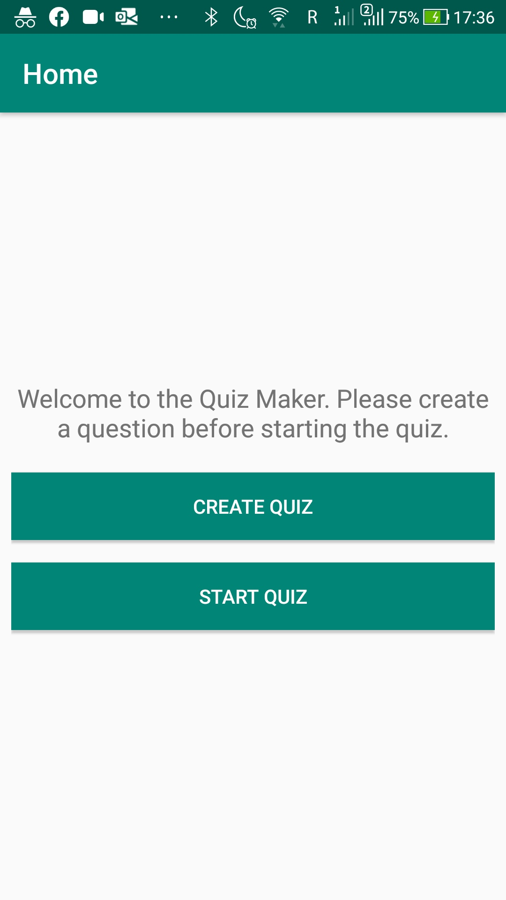
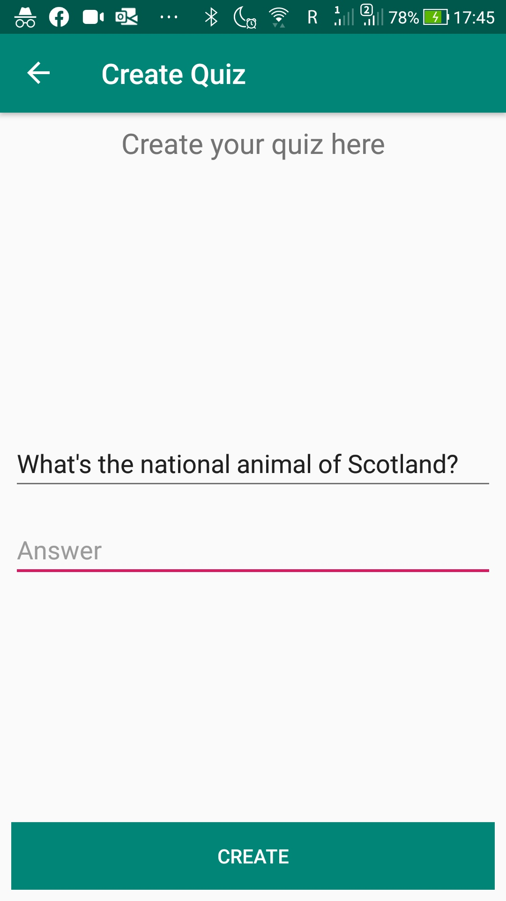
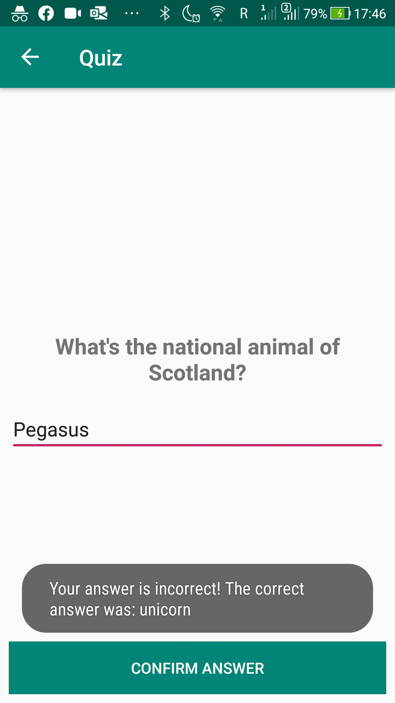
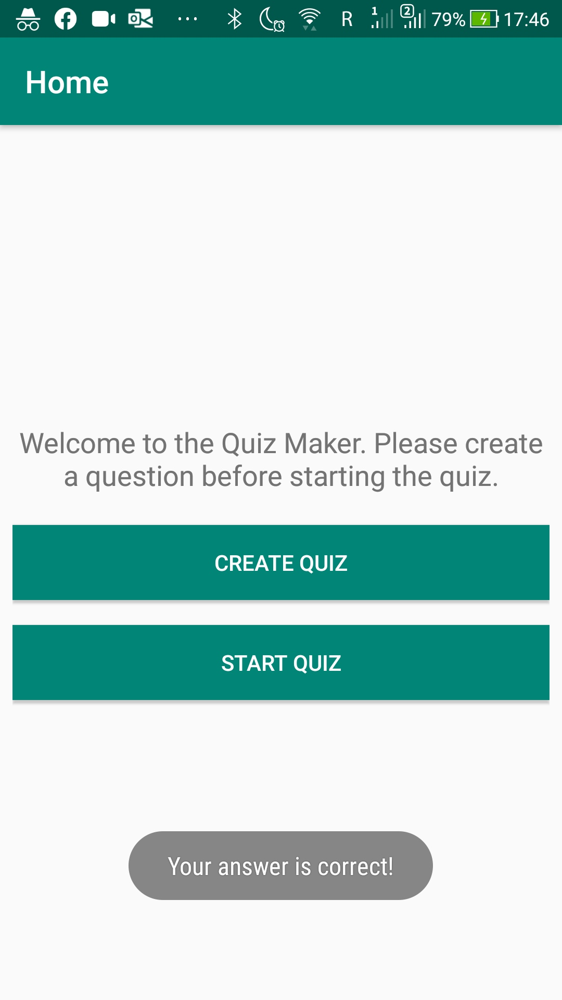

# Level 7 Example - Quiz Maker
This is a quiz app where the user can create a question he wants someone to answer. For simplicity of this example we have restricted the app to one question and they won’t be stored in Room.
## What's inside
The following new subjects were covered in this learning task:
* Navigating between menu items using Navigation Components
* Fragments
* Shared ViewModel

## Screenshots
    
    

